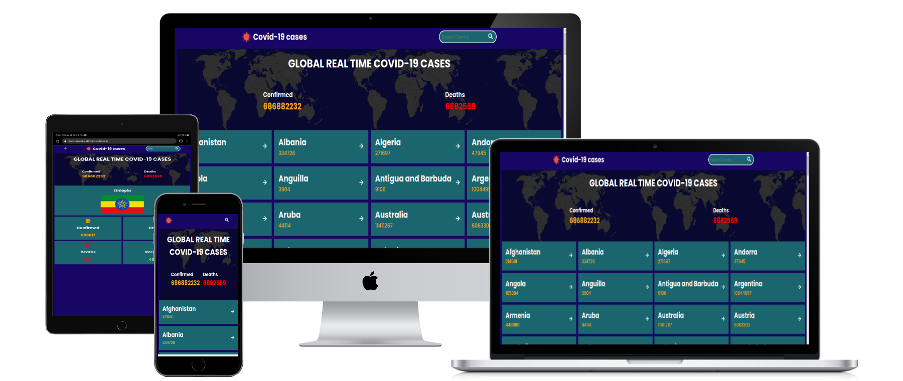
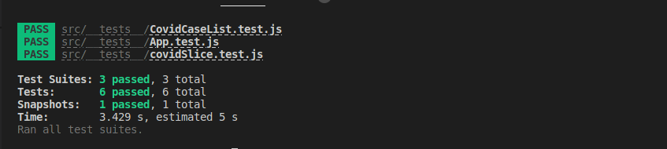

<a name="readme-top"></a>

<div align="center">
    
  <br/>
</div>
<h3><b>Global COVID-19 cases </b></h3>
</div>

<!-- TABLE OF CONTENTS -->

# 📗 Table of Contents<a name="table-contents"></a>

- [📖 About the Project](#about-project)
  - [🛠 Built With](#built-with)
    - [Tech Stack](#tech-stack)
    - [Key Features](#key-features)
  - [🚀 Live Demo](#live-demo)
- [💻 Getting Started](#getting-started)
  - [Setup](#setup)
  - [Prerequisites](#prerequisites)
  - [Install](#install)
  - [Usage](#usage)
- [👥 Authors](#authors)
- [🔭 Future Features](#future-features)
- [🤝 Contributing](#contributing)
- [⭐️ Show your support](#support)
- [🙏 Acknowledgements](#acknowledgements)
- [📝 License](#license)

<!-- PROJECT DESCRIPTION -->

A single page web application that provides a platform for scientists to get booked for reservations and join missions to space travel.
# 📖 Global COVID-19 cases  <a name="about-project"></a>

**Global COVID-19 cases** A react app that displays COVID-19 cases globally and shows real-time data of COVID-19 cases worldwide. It pulls data from reliable sources and displays it in an intuitive and user-friendly interface. Users can view cases by country, and view detail for each country.

Building this application will allow to learn how to use React and Redux in the context of a real application and get hand exprience on front-end development.

## 🛠 Built With <a name="built-with"></a> 

### Tech Stack <a name="tech-stack"></a>
> - [ReactJS](https://react.dev)
> - [Redux](https://react-redux.js.org)
> - [React-Boostrap](https://react-bootstrap.github.io/)
> - [Jest Test]()
> - [React Testing Library](https://testing-library.com/)

### Database <a name="data-base"></a>
- API dependdencies

<details>
  <summary>Client</summary>
  <ul>
    <li><a href="#">NA</a></li>
  </ul>
</details>

<details>
  <summary>Server</summary>
  <ul>
    <li><a href="#">N/A</a></li>
  </ul>
</details>

<details>
<summary>Database</summary>
  <ul>
    <li><a href="#">N/A</a></li>
  </ul>
</details>

<!-- Features -->

### Key Feature <a name="key-features"></a>
 - Fetching External API
 - Displays covid cases by country 
 - Searchs for details about cases for country

<p align="right">(<a href="#table-contents">back to top</a>)</p>

<!-- LIVE DEMO -->
## 🚀 Live Demo <a name="live-demo"></a> 
 Have a look at the [**Live Demo**](https://react-capstone-st7y.onrender.com/) for this app.

<!-- [Space Traveler's Hub]() -->

<p align="right">(<a href="#table-contents">back to top</a>)</p>

<!-- GETTING STARTED -->

## 💻 Getting Started <a name="getting-started"></a>

To get the content of this project locally you need to run the following commands in your terminal.

### Prerequisites

- IDE (code editor) like: VScode, Sublime, etc
- [Git](https://www.linode.com/docs/guides/how-to-install-git-on-linux-mac-and-windows/)

### Setup

1. Download the **Zip** file or clone the repo with:
```bash
git clone https://github.com/ZewdieMc/covid-19-cases
```
2. To access cloned directory run:
```bash
cd covid-19-cases
```

### Install

> To install linters and other project's dependencies run:

```bash
npm install
```

### Usage

To run the project, execute the following command: 

- Excute below command in the terminal to serve live 
```bash
npm run dev
```

## Run Test for Linters

For tracking linter errors locally you need to follow these steps:

1. For tracking linter errors in HTML files run:
```bash 
npx hint .
```

2. For tracking linter errors in CSS or SASS files run:

```bash
npx stylelint "\*_/_.{css,scss}"
```

3. For tracking linter errors in JavaScript files run:

```bash
npx eslint .
```
## Test Command

For unit testing of the app run:

 ```JS
npm test
```
<div align="center">
    
  <br/>
</div>

<!-- ### Deployment -->

<!-- [Space Traveler's Hub]() -->

<p align="right">(<a href="#table-contents">back to top</a>)</p>

<!-- AUTHOR -->


## 👤 **Author**

Zewdie Habtie
- GitHub: [Zewdie Habtie](https://github.com/ZewdieMc)
- Twitter: [Zewdie Habte](https://twitter.com/HabtieZewdie)

<p align="right">(<a href="#table-contents">back to top</a>)</p>

<!-- FUTURE FEATURES -->

## 🔭 Future Features <a name="future-features"></a>

- Implement additional pages such as about me, references, and etc

<p align="right">(<a href="#table-contents">back to top</a>)</p>

<!-- CONTRIBUTING -->

## 🤝 Contributing <a name="contributing"></a>

Contributions, issues, and feature requests are welcome!

[Kindly raise issue here](https://github.com/ZewdieMc/covid-19-cases/issues)

<p align="right">(<a href="#table-contents">back to top</a>)</p>

<!-- SUPPORT -->

## ⭐️ Show your support <a name="support"></a>

If you like this project, kindly follow me on GitHub 😊

<p align="right">(<a href="#table-contents">back to top</a>)</p>

<!-- ACKNOWLEDGEMENTS -->

## 🙏 Acknowledgments <a name="acknowledgements"></a>

Much appreciation goes to microverse and Space X for the availability of the API to practice.

<p align="right">(<a href="#table-contents">back to top</a>)</p>

<!-- LICENSE -->

## 📝 License <a name="license"></a>

This project is [MIT](./LICENSE) licensed.

<p align="right">(<a href="#table-contents">back to top</a>)</p>
